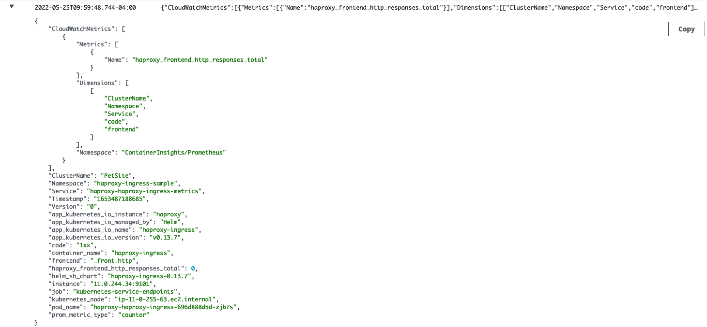
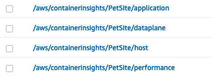
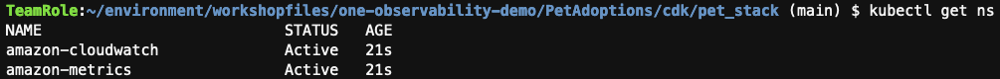
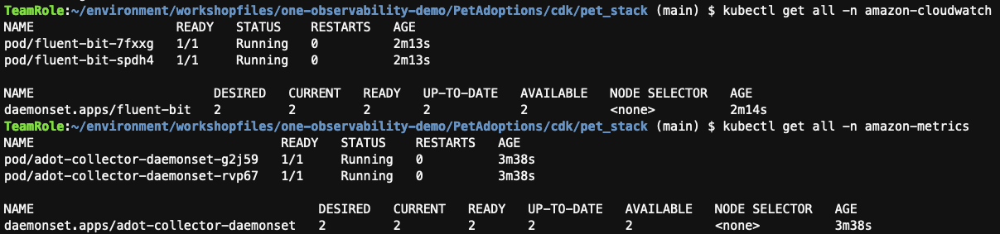
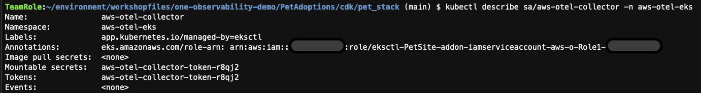
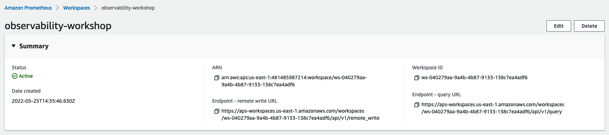
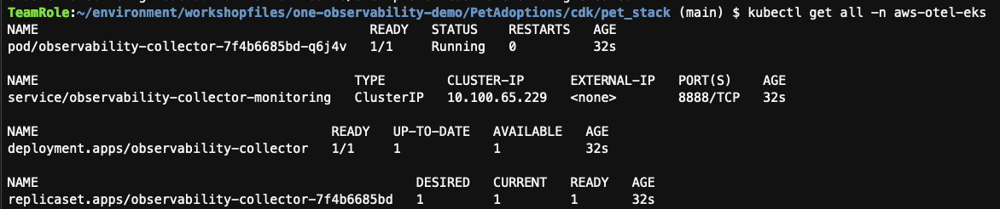

# Solution Focused Immersion Day - Observability

## Container Insights using ADOT Helm chart


### Deploy a HAProxy workload to collect Prometheus metrics


Start following instructions from “**To install HAProxy with a metric exporter to test Container Insights Prometheus support”** section onwards

https://docs.aws.amazon.com/AmazonCloudWatch/latest/monitoring/ContainerInsights-Prometheus-Sample-Workloads-haproxy.html

Wait for a bit more than a minute and go to CloudWatch Log groups and go to the `/aws/containerinsights/PetSite/prometheus`  log group and select `kubernetes-service-endpoints` log stream. Search for `haproxy` in the search box to see EMF events collected from the HAProxy workload.

Example here - 



### Using helm to install adot collector 

#### Delete the original namespace to avoid confusion

`kubectl delete ns amazon-cloudwatch`

#### Delete existing log groups

Select the log groups listed below and delete them



#### Setup IRSA 


The following command will create an IAM Role called `EKS-ADOT-CWCI-Helm-Chart-Role` and with a trust policy associated with a service account in the EKS cluster’s service account. After executing the command, go to IAM to explore it if you desire to do so.

```
chmod +x ./cwci-adot-irsa-setup.sh
./cwci-adot-irsa-setup.sh
```

#### Deploy  the ADOT helm chart 

```
CWCI_ADOT_HELM_ROLE_ARN=$(aws iam get-role --role-name EKS-ADOT-CWCI-Helm-Chart-Role | jq .Role.Arn -r)
```

```
helm repo add adot-helm-repo https://aws-observability.github.io/aws-otel-helm-charts
```

```
helm install adot-release adot-helm-repo/adot-exporter-for-eks-on-ec2  --set clusterName=PetSite --set awsRegion=us-east-1 --set fluentbit.enabled=true --set fluentbit.serviceAccount.annotations."eks\.amazonaws\.com/role-arn"="${CWCI_ADOT_HELM_ROLE_ARN}" --set adotCollector.daemonSet.serviceAccount.annotations."eks\.amazonaws\.com/role-arn"="${CWCI_ADOT_HELM_ROLE_ARN}" -f ./cwci-adot-helm-values-override.yaml
```


Execute the following command to see that two new namespaces have been created by the deployment


```
kubectl get ns
```



Execute the following command to see the fluentbit pod running under this namespace

```
kubectl get all -n amazon-cloudwatch
```

Execute the following command to see the adot collector pod running under this namespace

```
kubectl get all -n amazon-metrics
```



Wait for 2-3 minutes and go to the Container Insights page and select EKS Clusters from Performance monitoring screen and see metrics show up.

You should also see the log groups that you deleted earlier getting recreated as well.


#### Uninstall the helm release

```
helm uninstall adot-release
```

**-- End of Container Insights module --**

----------------------------------------


## Metric collection in Amazon Managed Service for Prometheus using ADOT Operator EKS Add-On

#### Delete existing namespace (if it exists already)

```
kubectl delete ns prometheus
```

#### Install Cert Manager

```
kubectl apply -f [https://github.com/cert-manager/cert-manager/releases/download/v1.5.0/cert-manager.yaml](https://github.com/cert-manager/cert-manager/releases/download/v1.8.0/cert-manager.yaml)
```

#### Setup RBAC permissions for the ADOT Operator Add-on

```
kubectl apply -f ./addons-otel-permissions.yaml
```

#### Install the ADOT Add-on

```
CLUSTER_NAME=PetSite
```


`aws eks create-addon --addon-name adot --addon-version v0.45.0-eksbuild.1 --cluster-name $CLUSTER_NAME`


#### Verify Add-On installation


Wait for 30 seconds and execute the following command. You should see `"ACTIVE"` as a result, indicating that the add-on is installed successfully.

```
aws eks describe-addon --addon-name adot --cluster-name $CLUSTER_NAME | jq .addon.status
```

#### Setup IRSA

This sets up an IAM role, a K8s Service Account and also annotates it with the IAM Role so when a K8s resource uses the Service Account, it can assume an IAM Role to access AWS resources.

```
eksctl create iamserviceaccount \
--name aws-otel-collector \
--namespace aws-otel-eks \
--cluster PetSite \
--attach-policy-arn arn:aws:iam::aws:policy/AmazonPrometheusRemoteWriteAccess \
--approve \
--override-existing-serviceaccounts
```


Execute the following command to see how this is setup


```
kubectl describe sa/aws-otel-collector -n aws-otel-eks
```




#### Deploy the OTEL Collector CRD

Open the file `otel-collector-prometheus-complete.yaml` and do the following


1. On line **301**, replace the value of the `endpoint` attribute to the Amazon Managed Prometheus workspace URL. You can get the URL from the `Endpoint - remote write URL` section in the `Summary` page.



1. On line **303**, set the value of `region` attribute to `us-east-1`

1. Save and close the file.

```
kubectl apply -f ./otel-collector-prometheus-complete.yaml
```


Execute the following command to see that the collector is running


```
kubectl get all -n aws-otel-eks
```



Now you have the ADOT Collector sending metrics to the Amazon Managed Service for Prometheus workspace. Go to Amazon Managed Grafana and query the metrics to visualize.

**-- End of ADOT and Amazon Managed Service for Prometheus module --**

---------